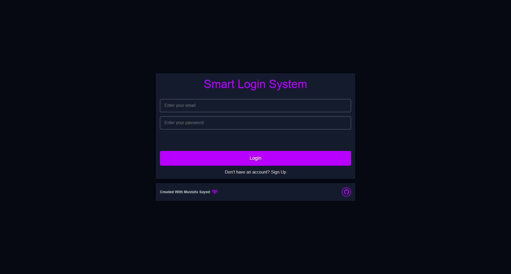

# Smart Login System 🔐

A simple and responsive login/signup system built using **HTML**, **CSS**, and **JavaScript**.

## 📸 Preview

<a href='https://mustafa-sayed-m.github.io/Smart-Login-System/index.html' target='_blank'>
    
</a>

`click on image to go live demo`

## 📁 Project Structure

```sh
    project-root/
    ├── css/
    │ ├── global.css
    │ ├── home.css
    │ └── index.css
    ├── js/
    │ ├── global.js
    │ ├── home.js
    │ └── index.js
    ├── home.html
    └── index.html
```

## 📄 Pages

- `index.html`: Contains the **Smart Login System** with login and signup forms.
- `home.html`: Likely the homepage after login.

## 🎯 Features

- Login and signup forms with validation
- Responsive layout using custom CSS
- Form switching between login and signup
- Toast notifications using [ToastifyJS](https://github.com/apvarun/toastify-js)

## 🚀 How to Use

1. Download or clone the repository.
2. Open `index.html` in your browser.
3. Try the login or signup functionality.
4. Modify or enhance the code to suit your needs.

## 🛠 Technologies Used

- HTML5
- CSS3
- JavaScript (Vanilla)
- Toastify JS (for notifications)

## 🙋‍♂️ Author

**Mustafa Sayed**

- GitHub: [@Mustafa-Sayed-M](https://github.com/Mustafa-Sayed-M)

---

Feel free to fork, contribute, or raise issues for improvements!
